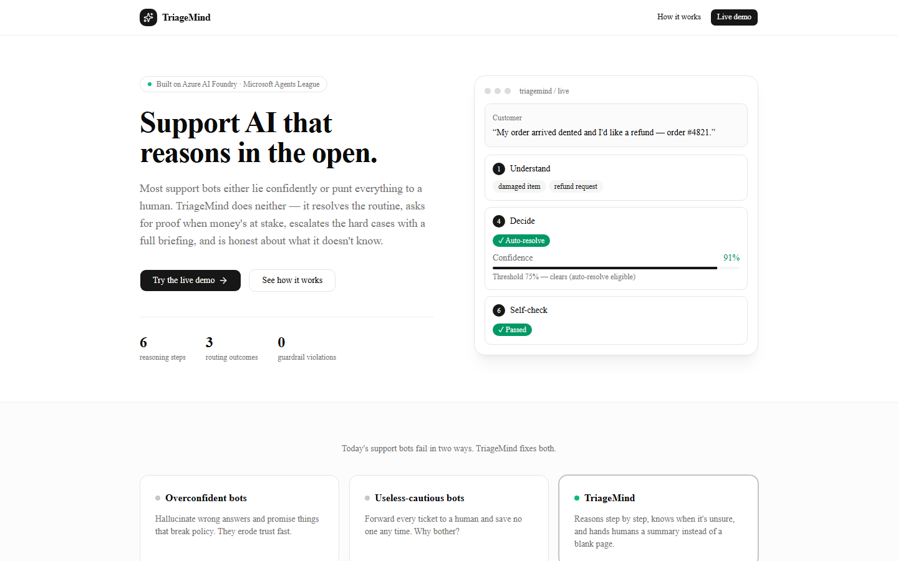
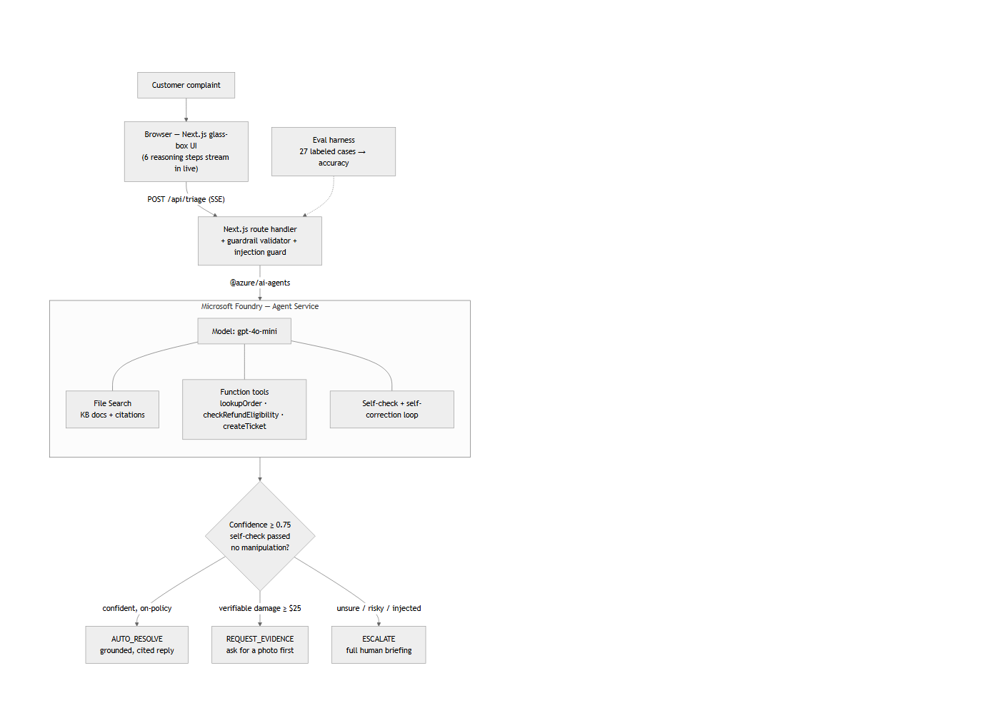

# TriageMind

> A support agent that takes real actions, shows its reasoning, refuses to break policy, and comes with measured proof that it works.

Built for the **Microsoft Agents League @ AI Skills Fest** — **Reasoning Agents** track (Microsoft Foundry).



Most "AI support bots" either lie confidently or punt everything to a human. TriageMind does neither: it **resolves the routine, asks for proof when money's at stake, escalates the hard cases with a full briefing, and is honest about what it doesn't know**.

---

## How it works — 6 visible reasoning steps

Every complaint runs through six steps, each streamed live to a glass-box UI:

1. **Understand** — extract issues, intent, churn risk
2. **Classify** — severity, category, sentiment
3. **Ground** — pull KB passages + citations (Foundry File Search)
4. **Decide** — route the case, with a confidence score
5. **Draft** — a grounded, cited reply *or* a human briefing
6. **Self-check** — validate against policy; self-correct or escalate

## One decision, three honest outcomes

| Route | When | What it does |
|---|---|---|
| ✓ **AUTO_RESOLVE** | Confident (≥ 0.75) + self-check passes + on-policy | Sends a grounded, cited reply automatically |
| 📷 **REQUEST_EVIDENCE** | Photographable damage claim ≥ $25, no photo yet | Politely asks for a photo before refunding |
| ↗ **ESCALATE** | Unsure, high-severity, churn risk, or a manipulation attempt | Hands a human a full briefing, not a blank page |

## The X-factors

- **Knows its limits** — confidence-gated routing; auto-resolves only when sure
- **Catches its own mistakes** — self-verification + self-correction loop (max 2 retries)
- **Cites its sources** — answers grounded in policy docs, every claim linked
- **Takes real actions** — calls function tools (look up order, check refund eligibility, open ticket)
- **Can't break policy** — hard guardrails + an input-side prompt-injection guard
- **Proves it works** — an evaluation harness reports measured accuracy

## Architecture



The agent core runs on **Microsoft Foundry — Agent Service**: `gpt-4o-mini`, File Search for grounding, and function tools. A Next.js route streams each reasoning step to the browser over SSE; a guardrail validator and prompt-injection guard wrap the agent.

## Evaluation

```bash
npm run eval
```

Runs every labeled complaint in [`eval/testset.json`](eval/testset.json) (27 cases, incl. prompt-injection attacks) through the agent and reports classification accuracy, escalation-decision accuracy, and guardrail violations.

> Current stub baseline: **70% / 70%**, **0 guardrail violations**. The headline number from the Foundry agent is added once the live agent is wired in.

## Tech stack

- **Agent core:** Microsoft Foundry Agent Service (`@azure/ai-agents`, `@azure/ai-projects`) — File Search + function tools
- **Model:** `gpt-4o-mini` (dev) → `gpt-4o` (demo)
- **App:** Next.js 16 (App Router) + React 19 + Tailwind v4 + shadcn/ui
- **Streaming:** SSE from a Next.js route → animated glass-box UI
- **Auth:** keyless via Entra ID (`DefaultAzureCredential`)
- **Eval:** Node + TypeScript harness over a labeled test set

## Getting started

```bash
npm install

# Azure / Foundry (keyless auth)
az login                          # sign in to the subscription with your Foundry project
cp .env.example .env.local        # then set AZURE_AI_PROJECT_ENDPOINT + deployment name

npm run dev                       # http://localhost:3000
npm run smoke                     # verify the Foundry connection
npm run eval                      # prints the accuracy report
```

`.env.local`:

```
AZURE_AI_PROJECT_ENDPOINT=https://<resource>.services.ai.azure.com/api/projects/<projectName>
AZURE_AI_MODEL_DEPLOYMENT=gpt-4o-mini
```

## Project structure

```
src/app/            # landing page (/), demo UI (/demo), API route (/api/triage)
src/lib/            # agent engine, Foundry client, tools, guardrails, types
src/components/     # glass-box UI (ReasoningTrail, ConfidenceMeter, RouteBadge)
knowledge-base/     # policy docs fed to File Search
eval/               # testset.json + run-eval.ts
docs/               # PRD, architecture diagram, screenshot
```

## Team

- **Sohan Meghraj** (solo) — Microsoft Learn username: `<add-your-MS-Learn-username>`

## License

[MIT](LICENSE) © 2026 Sohan Meghraj
